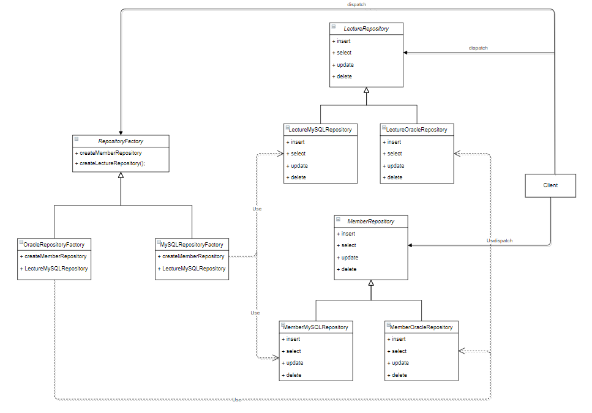

# 📜 추상 팩토리 패턴(Abstract Factory Pattern)

<br />

`생성 패턴` 중 하나인 추상 팩토리 패턴은 어떤 추상화된 군집체를 한번에 생성해내는 패턴을 의미합니다.

[헤드 퍼스트 디자인 패턴](http://www.kyobobook.co.kr/product/detailViewKor.laf?mallGb=KOR&ejkGb=KOR&barcode=9788979143409) 에서는 이 개념을 피자가게에서 여러 종류의 피자를 만들어내는 개념으로 풀어서 설명합니다.

예를 들어 피자가게에 시카고 피자, 디트로이트 피자, 하와이안 피자 등의 여러 피자가 있다고 가정하고, 고객이 어떤 피자를 주문하면 한번의 호출로 그 피자를 생성해내는 식입니다.

이 예제에서는 각 데이터베이스 벤더별로 데이터베이스에 접근하는 `DAO`를 여러개 두고, 한번의 호출로 모든 `콘크리트 클래스`를 생성해내는 예제를 구현했습니다.

`클래스 다이어그램`은 다음과 같습니다.

<br />



<br />

클라이언트는 오로지 `RepositoryFactory`에 자신이 사용하고자 하는 데이터베이스만 전달하면, 해당 데이터베이스에 맞게 구현된 모든 `DAO`를 얻을 수 있을 겁니다.

<br  />

```java
// 추상 팩토리를 선언합니다.
// 이 팩토리는 클라이언트의 메시지를 받아 각 DAO를 생성해주는 책임을 갖습니다.
public interface RepositoryFactory {
    MemberRepository createMemberRepository();

    LectureRepository createLectureRepository();
}

public class MySQLRepositoryFactory implements RepositoryFactory {
    @Override
    public MemberRepository createMemberRepository() {
        return new MemberMySQLRepository();
    }

    @Override
    public LectureRepository createLectureRepository() {
        return new LectureMySQLRepository();
    }
}

public class OracleRepositoryFactory implements RepositoryFactory {
    @Override
    public MemberRepository createMemberRepository() {
        return new MemberOracleRepository();
    }

    @Override
    public LectureRepository createLectureRepository() {
        return new LectureOracleRepository();
    }
}

public interface LectureRepository {
    void insert(Lecture lecture);

    void select(Lecture lecture);

    void update(Lecture lecture);

    void delete(Lecture lecture);
}

public class LectureMySQLRepository implements LectureRepository {
    @Override
    public void insert(Lecture lecture) {
        System.out.println("MySQL :: insert :: " + lecture);
    }

    @Override
    public void select(Lecture lecture) {
        System.out.println("MySQL :: select :: " + lecture);
    }

    @Override
    public void update(Lecture lecture) {
        System.out.println("MySQL :: update :: " + lecture);
    }

    @Override
    public void delete(Lecture lecture) {
        System.out.println("MySQL :: delete :: " + lecture);
    }
}

public class LectureOracleRepository implements LectureRepository {
    @Override
    public void insert(Lecture lecture) {
        System.out.println("Oracle :: insert :: " + lecture);
    }

    @Override
    public void select(Lecture lecture) {
        System.out.println("Oracle :: select :: " + lecture);
    }

    @Override
    public void update(Lecture lecture) {
        System.out.println("Oracle :: update :: " + lecture);
    }

    @Override
    public void delete(Lecture lecture) {
        System.out.println("Oracle :: delete :: " + lecture);
    }
}

public interface MemberRepository {
    void insert(Member member);

    void select(Member member);

    void update(Member member);

    void delete(Member member);
}

public class MemberMySQLRepository implements MemberRepository {
    @Override
    public void insert(Member member) {
        System.out.println("MySQL :: insert :: " + member);
    }

    @Override
    public void select(Member member) {
        System.out.println("MySQL :: select :: " + member);
    }

    @Override
    public void update(Member member) {
        System.out.println("MySQL :: update :: " + member);
    }

    @Override
    public void delete(Member member) {
        System.out.println("MySQL :: delete :: " + member);
    }
}

public class MemberOracleRepository implements MemberRepository {
    @Override
    public void insert(Member member) {
        System.out.println("Oracle :: insert :: " + member);
    }

    @Override
    public void select(Member member) {
        System.out.println("Oracle :: select :: " + member);
    }

    @Override
    public void update(Member member) {
        System.out.println("Oracle :: update :: " + member);
    }

    @Override
    public void delete(Member member) {
        System.out.println("Oracle :: delete :: " + member);
    }
}
```

<br />

내부 구현은 모두 어떤 메서드가 실행됐는지 정도만 알아볼 수 있게 표준출력을 이용하였습니다.

그리고 이렇게 작성한 추상 팩토리를 사용하는 `Client`를 작성합니다.

<br />

```java
import io.github.shirohoo.creational.abstract_factory.model.Lecture;

public class ConsoleRunner {
    private static final String DATABASE = "database";

    public static void main(String[] args) throws Exception {
        // 추상 팩토리에 사용하고자 하는 데이터베이스 벤더를 전달합니다.
        RepositoryFactory factory = getFactory(readProperties().getProperty(DATABASE));

        memberCrud(createMember(), factory.createMemberRepository());

        System.out.println();

        lectureCrud(createLecture(), factory.createLectureRepository());
    }

    // 전달받은 데이터베이스를 토대로 추상 팩토리에 해당 데이터베이스 군집체 생성을 요청합니다.
    private static RepositoryFactory getFactory(String database) {
        if (Objects.equals(database, DatabaseType.MYSQL.getDatabase())) {
            return new MySQLRepositoryFactory();
        }

        if (Objects.equals(database, DatabaseType.ORACLE.getDatabase())) {
            return new OracleRepositoryFactory();
        }

        throw new IllegalArgumentException("database not found !");
    }

    // 프로퍼티에 정의한 데이터베이스를 읽어옵니다.
    private static Properties readProperties() throws Exception {
        Properties props = new Properties();
        FileInputStream fis = new FileInputStream("src/io/github/shirohoo/creational/abstract_factory/resources/application.properties");
        props.load(fis);
        return props;
    }

    private static Member createMember() {
        return Member.of("member@gmail.com", "password");
    }

    private static Lecture createLecture() {
        return Lecture.of(1L, "teacher", "title");
    }

    private static void lectureCrud(Lecture lecture, LectureRepository lectureRepository) {
        lectureRepository.insert(lecture);
        lectureRepository.select(lecture);
        lectureRepository.update(lecture);
        lectureRepository.delete(lecture);
    }

    private static void memberCrud(Member member, MemberRepository memberRepository) {
        memberRepository.insert(member);
        memberRepository.select(member);
        memberRepository.update(member);
        memberRepository.delete(member);
    }
}
```

<br />

자바 코드는 전혀 변한게 없으며, 오로지 프로퍼티 파일에서 어떤 데이터베이스를 사용할지만 변경하였고, 이에 따른 결과는 다음과 같습니다.

<br />


<br />


<br />


<br />


<br />
